# Documentación del uso de IA — Proyecto M4

## Herramienta utilizada

**Claude Code** (Anthropic) y **Codex** (OpenAI)

---

## Forma de trabajo

Se configuró Claude Code con dos archivos de instrucciones:

- `CLAUDE.md`: define el alcance del proyecto, las fases, las reglas de implementación y las preferencias técnicas.
- `AGENTS.md`: define el rol de la IA (guía técnico-práctica), el perfil del usuario, el orden de prioridades y las reglas de comportamiento durante el desarrollo.

La IA no actúa de forma autónoma. Cada acción fue solicitada explícitamente por el usuario. Antes de implementar cualquier cambio, se explicó qué se iba a hacer y por qué.

---

## Sesión: Fase 0 — Base del proyecto

**Fecha:** 22/04/2026

### Qué se pidió

Construir la base limpia del proyecto para la Fase 0:

- Entender el estado actual del proyecto (ya tenía Vite + React + TypeScript inicializado)
- Limpiar los archivos de demo generados por Vite
- Crear la estructura de carpetas basada en features
- Instalar y configurar React Router
- Crear el layout base, la página Home y la página 404
- Conectar todo a través del router

### Cómo se construyó la estructura

El proyecto ya tenía Vite + React + TypeScript inicializado, pero solo con los archivos de demo por defecto de Vite. La IA leyó el estado actual (`main.tsx`, `App.tsx`, `package.json`, `index.html`) y a partir de ahí construyó la base real del proyecto.

**Paso 1 — Limpieza**

Se reemplazó el `App.tsx` de demo por un componente limpio que únicamente monta el router. Se eliminó el import de `App.css` de `main.tsx`. Los archivos de estilos de demo (`App.css`, `index.css`) los eliminó el usuario manualmente.

**Paso 2 — Estructura de carpetas por features**

Se creó una organización basada en dominios funcionales:

```
src/
  app/router/           → infraestructura global del router
  features/home/        → todo lo relacionado con la página de inicio
  features/not-found/   → todo lo relacionado con el 404
  shared/components/layout/  → piezas visuales reutilizables entre features
```

La idea detrás de esta estructura es que cada funcionalidad viva junta. Lo específico de cada página va en `features/`. Lo que comparten todas las páginas va en `shared/`. Esto no importa mucho con 2 páginas, pero escala bien cuando el proyecto crece.

**Paso 3 — Router**

Se creó `src/app/router/router.tsx` con `createBrowserRouter` de React Router. Define dos reglas:

- `/` → renderiza `AppLayout` con `HomePage` dentro
- `*` → cualquier URL desconocida → renderiza `NotFoundPage`

Se separó en su propio archivo para que la configuración del router no ensucie `App.tsx` ni `main.tsx`.

**Paso 4 — Layout base**

Se creó `AppLayout.tsx` con la estructura visual común: header, main y footer. El elemento clave es `<Outlet />`, que es el hueco donde React Router inyecta la página activa según la URL. Cualquier página futura que use este layout solo tiene que registrarse como `children` en el router.

**Paso 5 — Páginas**

Se crearon `HomePage.tsx` y `NotFoundPage.tsx` como componentes simples. No saben nada del layout ni del router, solo devuelven su contenido. `NotFoundPage` incluye un `<Link to="/">` para volver al inicio sin recargar la página.

### Explicación del flujo

Tras implementar la estructura, la IA explicó el flujo completo de arranque de la app archivo por archivo, cubriendo cada concepto nuevo que aparecía (SPA, componentes, JSX, router, layout, `<Outlet />`, `<Link />`).

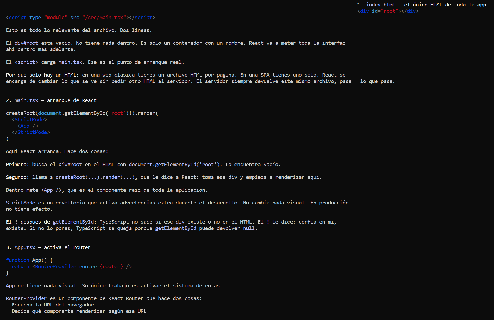
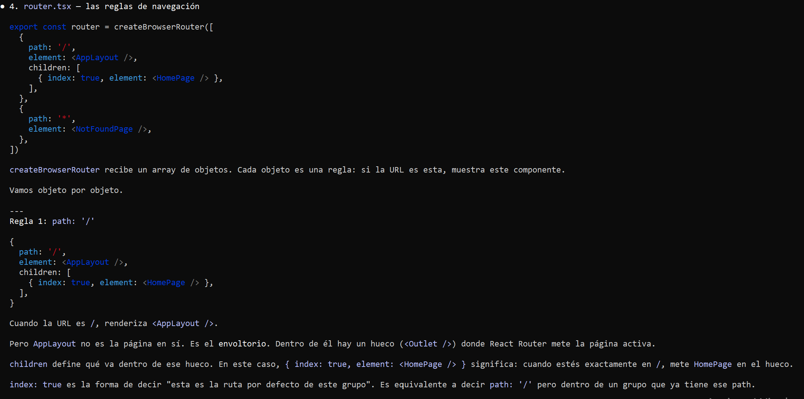
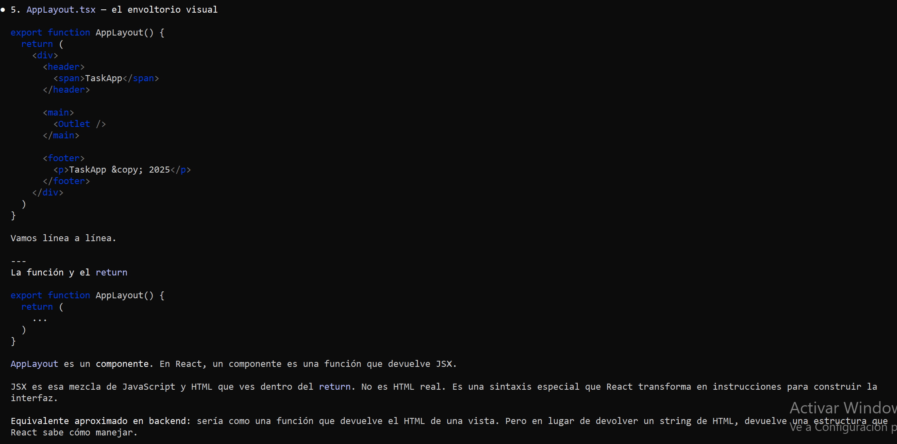
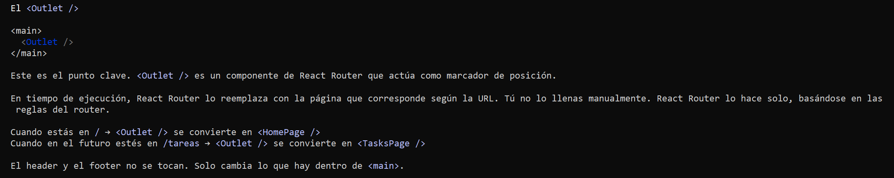
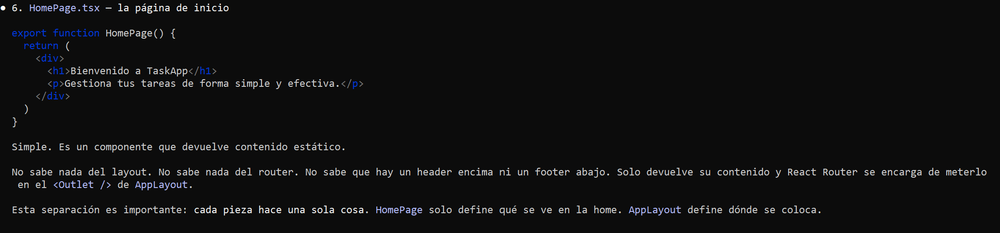

---

## Sesión: Fase 1 — Autenticación

**Fecha:** 29/04/2026

### Qué implementó la IA

- Configuración base de Firebase con variables de entorno (`.env`, `.env.example`, `firebase.ts`)
- Servicio de autenticación con registro, login y logout (`authService.ts`)
- Contexto de autenticación para exponer el usuario a toda la app (`AuthContext.tsx`, `useAuth`)
- Páginas de login y registro con formularios controlados y estados de carga
- Protección de rutas privadas (`ProtectedRoute.tsx`)
- Dashboard mínimo para validar el flujo completo
- Router actualizado con rutas públicas y privadas
- Mensajes de error específicos por código de Firebase (`getAuthErrorMessage`)
- Configuración de debug en VS Code (`launch.json`)

### Qué explicó la IA

La IA explicó cada pieza antes o después de implementarla. Los conceptos cubiertos fueron: qué es Firebase Auth y cómo se relaciona con una llamada a API REST, qué es React Context y para qué sirve (comparado con pasar props manualmente), cómo funciona `onAuthStateChanged` para mantener la sesión al recargar, qué es un controlled component, cómo funciona `ProtectedRoute` como equivalente al middleware de auth en Laravel/PHP, y cómo los códigos de error de Firebase funcionan igual que los códigos HTTP.

### Resultado verificado

El usuario probó el flujo completo: registro, login, persistencia de sesión al recargar, logout y protección de rutas. Todo funcionó correctamente.

<!-- capturas de la sesión Fase 1 -->

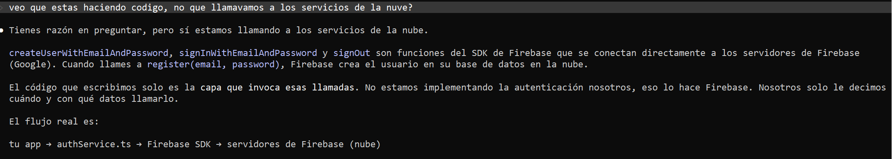
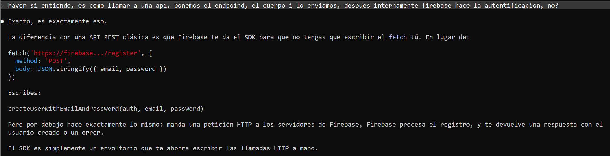
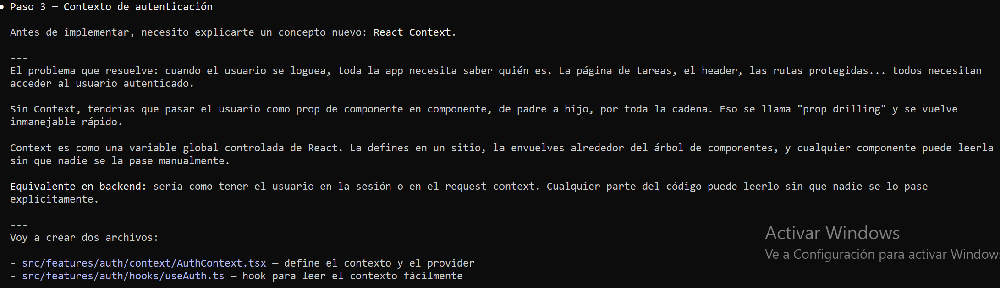
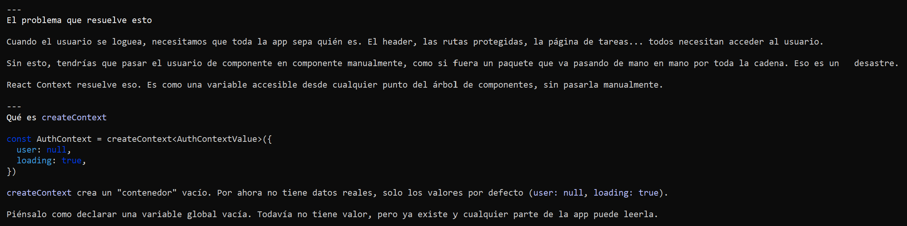
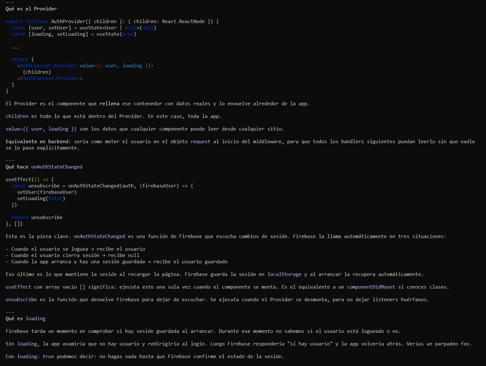
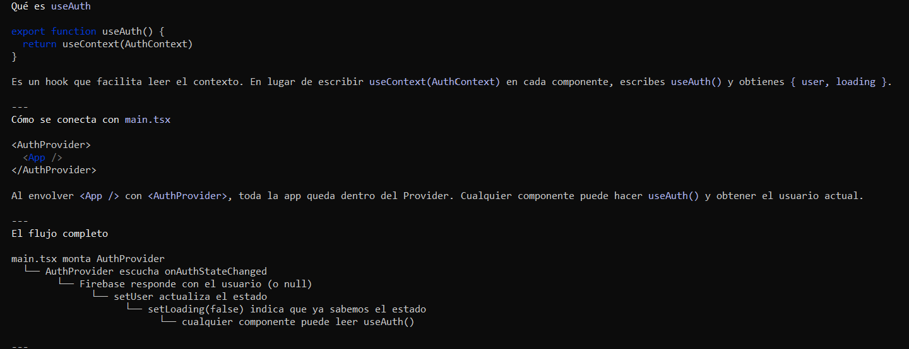
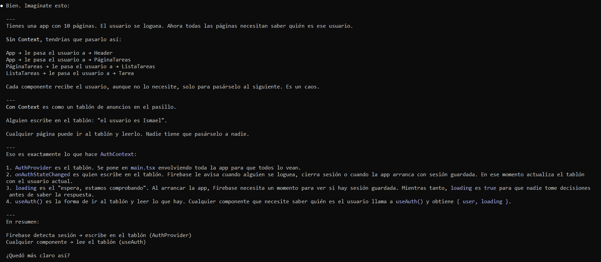
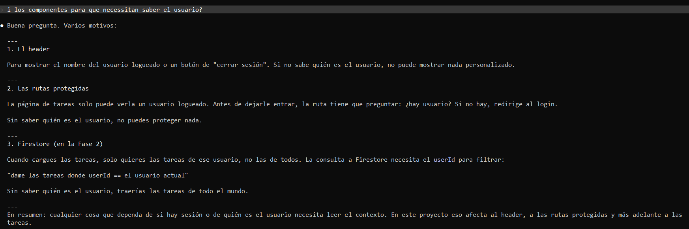
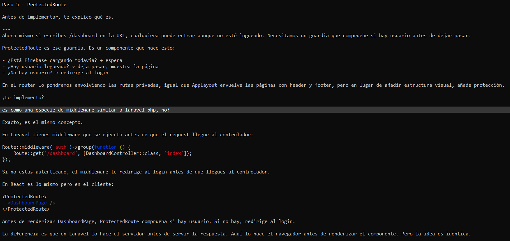
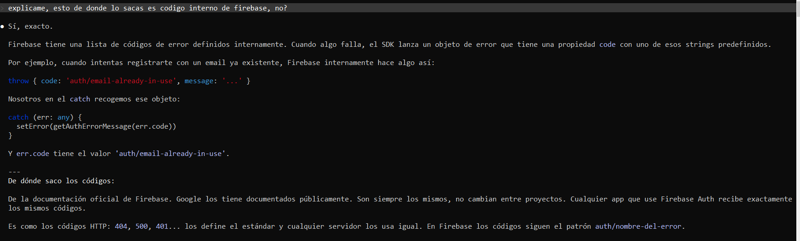

---

## Sesión: Fase 2 — Tareas con Firestore

**Fecha:** 01/05/2026

### Qué implementó la IA

- Configuración de Firestore en `firebase.ts` (exportación de `db`)
- Modelo de tarea (`task.ts`) con los campos: `id`, `title`, `description`, `completed`, `userId`, `createdAt`
- Servicio de tareas (`taskService.ts`) con `createTask` y `getUserTasks`, filtrando siempre por `userId` desde Firestore
- Formulario mínimo de creación de tareas (`TaskForm.tsx`) con estados de carga y error
- Lista de tareas (`TaskList.tsx`) con estado vacío
- Dashboard actualizado para coordinar carga de tareas, formulario y listado
- Diagnóstico y resolución de error por índice compuesto faltante en Firestore

### Qué explicó la IA

La IA explicó cómo funciona Firestore (colecciones, documentos, `addDoc`, `getDocs`, `query`, `where`, `orderBy`), por qué filtrar por `userId` en Firestore y no en el frontend, el patrón de callback `onTaskCreated` para recargar la lista tras crear una tarea, y qué son los índices compuestos en Firestore y por qué son necesarios al combinar `where` + `orderBy`.

### Resultado verificado

El usuario probó el flujo completo: crear una tarea, verla aparecer en la lista, recargar la página y comprobar que persiste. Todo funcionó correctamente.

<!-- capturas de la sesión Fase 2 -->

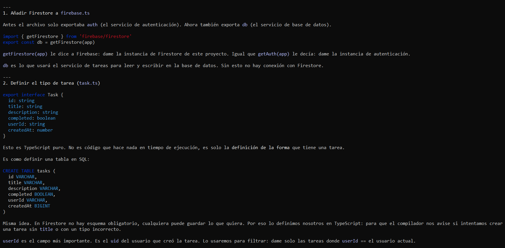
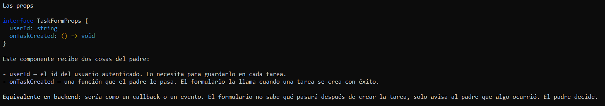
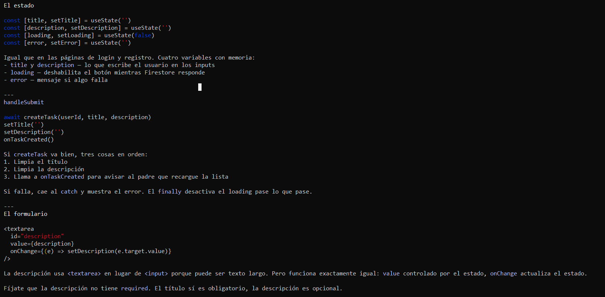
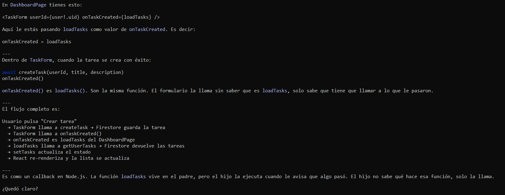
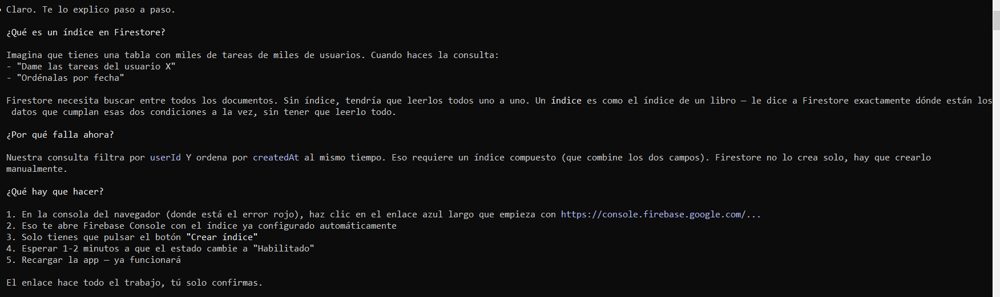

---

## Sesión: Fase 3 — CRUD completo de tareas

**Fecha:** 02/05/2026

### Qué implementó la IA

- Tres funciones nuevas en `taskService.ts`: `toggleTaskCompleted`, `updateTask` y `deleteTask` usando `updateDoc` y `deleteDoc` de Firestore
- Separación del formulario de edición en su propio componente `TaskEditForm.tsx`
- `TaskList.tsx` refactorizado para gestionar solo el estado de edición (`editingId`) y delegar el formulario a `TaskEditForm`
- Handlers en `DashboardPage.tsx` para las tres nuevas operaciones, con comprobación de usuario autenticado y estado `actionLoading`
- Botones deshabilitados durante operaciones en curso para evitar acciones duplicadas

### Qué explicó la IA

La IA explicó la diferencia entre `collection` (apunta a toda la colección) y `doc` (apunta a un documento concreto), equivalente a un `WHERE id = X` en SQL. También explicó por qué el estado de edición vive en `TaskList` y no en `DashboardPage` (es información puramente visual), el patrón `finally` para garantizar que `actionLoading` vuelve a `false` aunque falle la operación, y por qué `if (!user) return` en los handlers es una segunda línea de defensa además de las reglas de Firestore.

### Resultado verificado

El usuario probó el flujo completo: marcar tareas como completadas, editarlas, eliminarlas con confirmación y comprobar que los cambios persisten al recargar. Todo funcionó correctamente.

<!-- capturas de la sesión Fase 3 -->

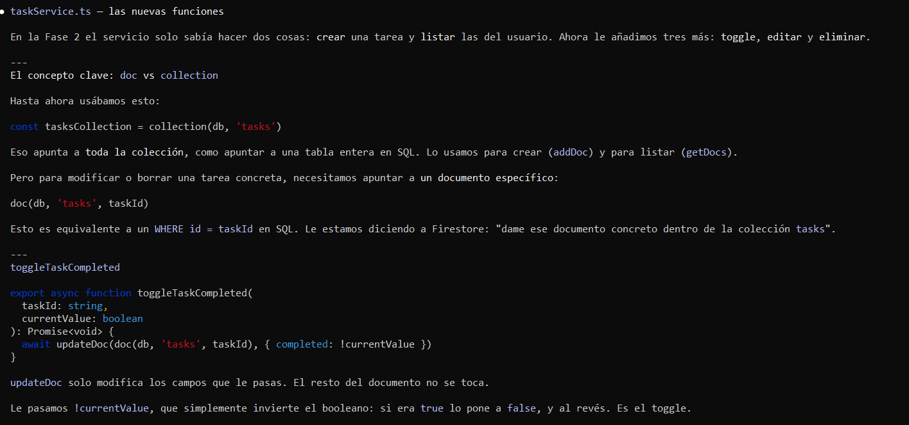
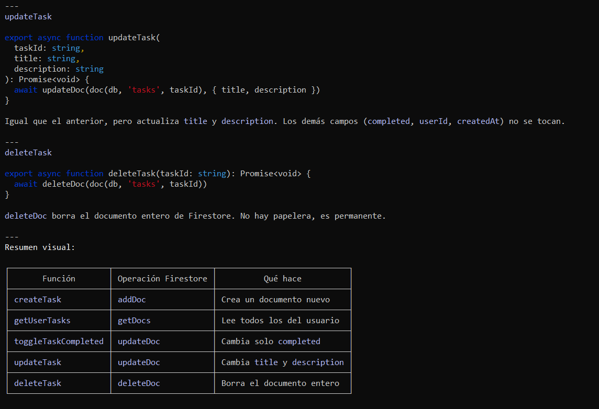
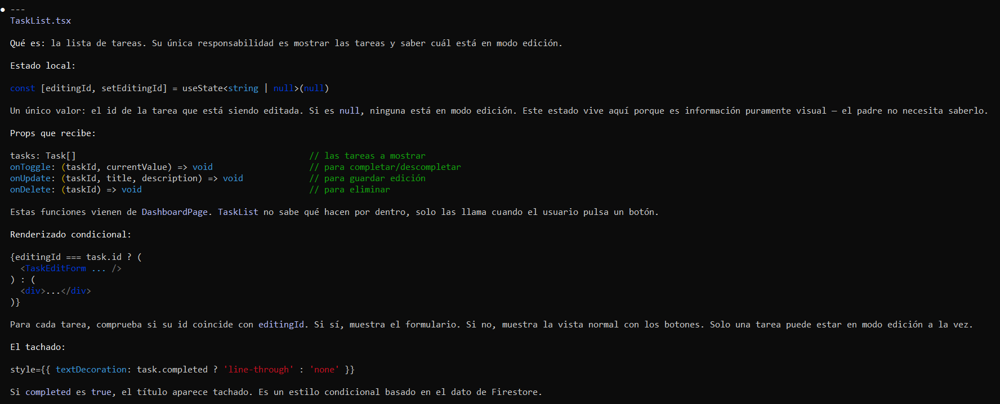
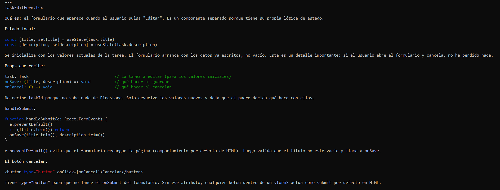
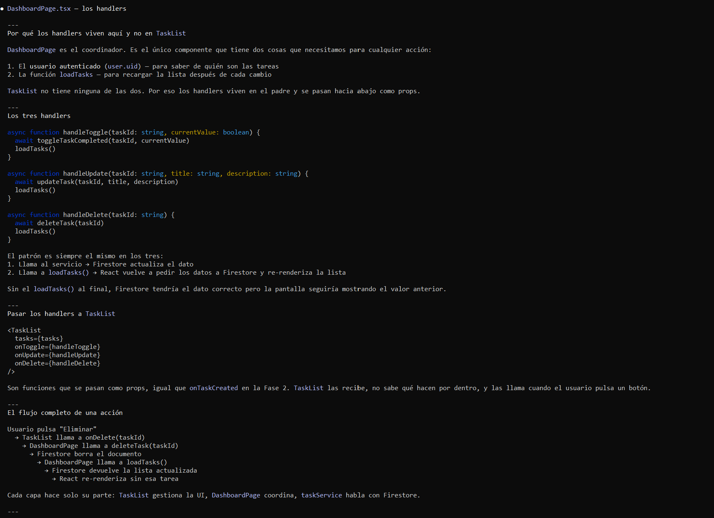
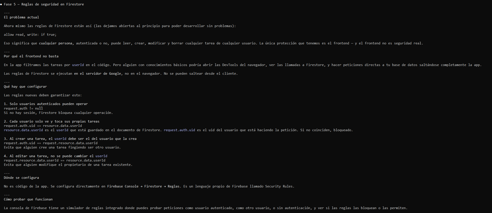

---

## Sesión: Fase 6 — Envío de resumen de tareas por email con AWS SES

**Fecha:** 04/05/2026

### Herramientas utilizadas

- **ChatGPT** — configuración de AWS: creación de cuenta, verificación de email en SES, creación de usuario IAM y credenciales de acceso.
- **Claude Code** — implementación completa del código de la fase.

### Qué implementó Claude Code

- Vercel Function en `api/send-task-summary.ts` que recibe el resumen por POST y lo envía con AWS SES
- Helper `buildTaskSummary.ts` que genera el texto plano del resumen a partir de las tareas
- Servicio frontend `taskEmailService.ts` que hace el fetch al endpoint
- Componente `SendTaskSummaryButton.tsx` con estados de envío, éxito y error
- Integración del botón en `DashboardPage.tsx`
- Configuración de debug en `.vscode/launch.json` con dos perfiles: Vite y Vercel
- Logs de servidor en la Vercel Function para depurar el flujo desde la terminal

### Qué explicó Claude Code

La IA explicó por qué las credenciales AWS no pueden ir en el frontend (variables `VITE_` se exponen al navegador), qué es una Vercel Function y por qué actúa como capa segura entre React y AWS SES, la diferencia entre el puerto de la app (`3000`) y el puerto del inspector de Node.js (`9229`), y por qué el debugger de Chrome no puede acceder a código que corre en Node.js.

### Resultado verificado

El usuario depuró el flujo completo con breakpoints en el frontend y logs en la terminal del servidor. El email se envía correctamente y la app muestra los estados de envío, éxito y error.

<!-- capturas de la sesión Fase 6 -->

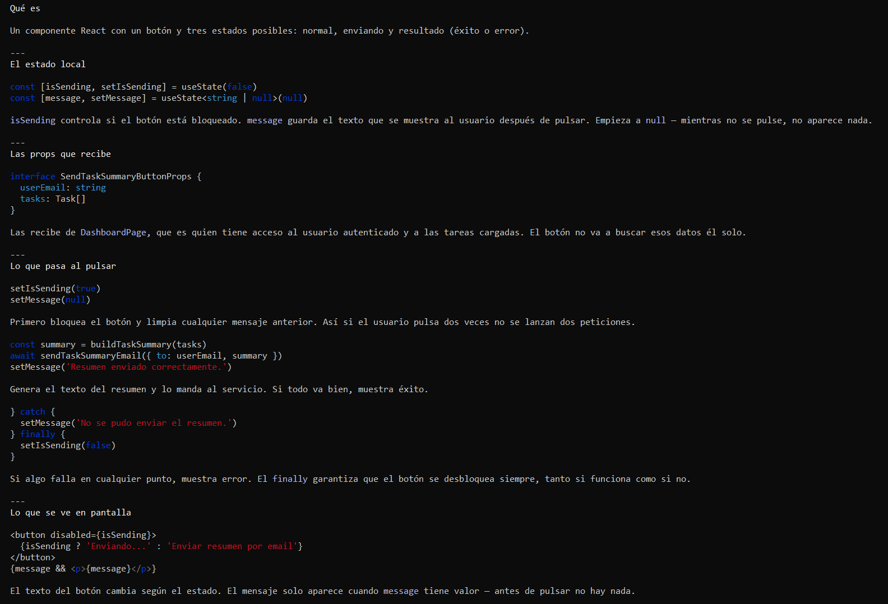
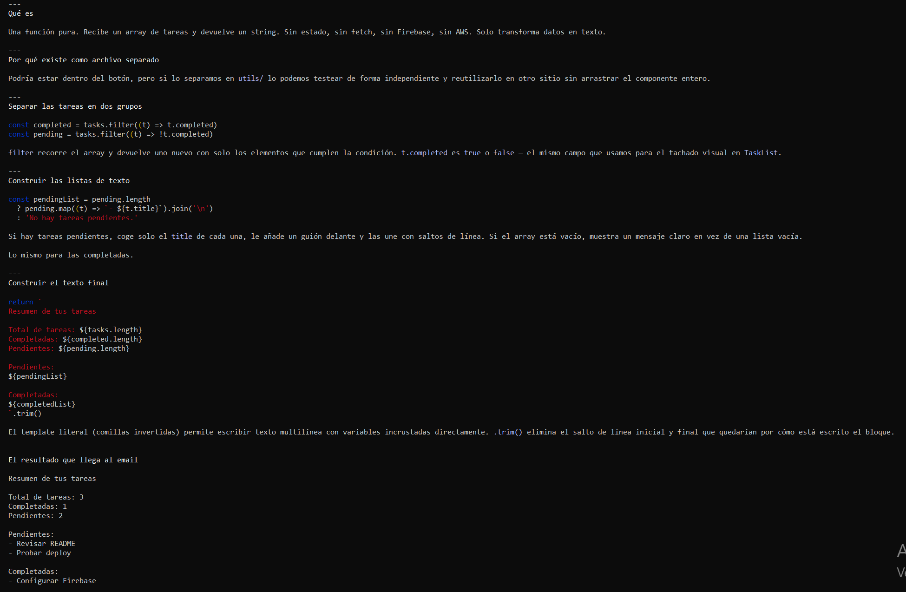
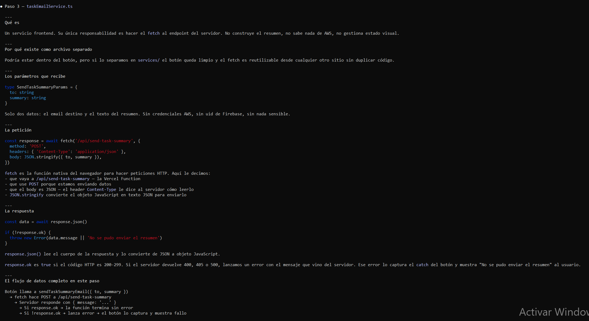
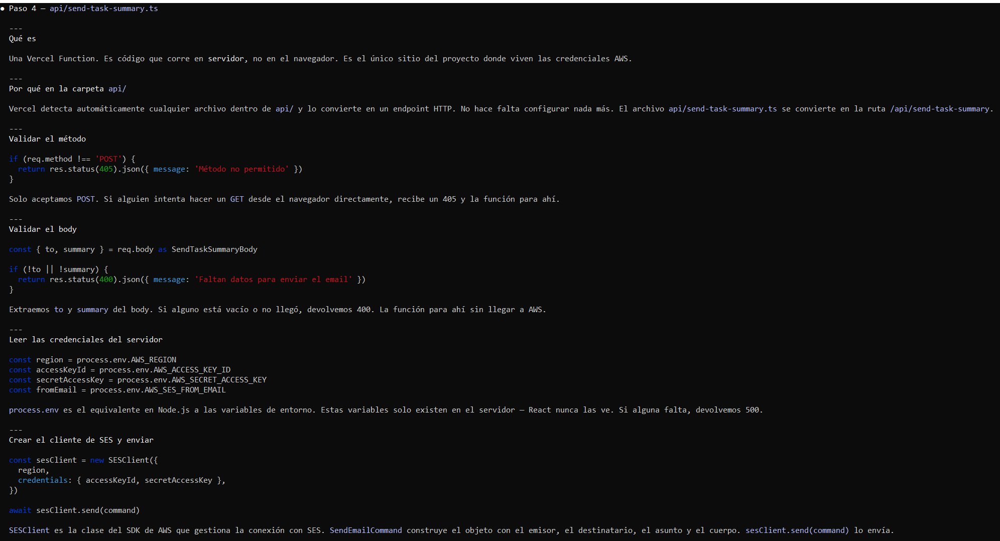
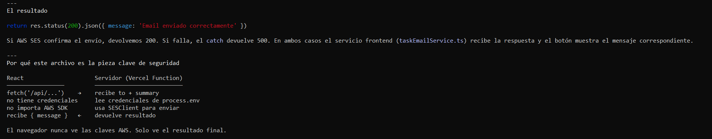

---

## Criterio de uso

La IA se usa como **par técnico y guía de aprendizaje**, no como generador automático de código.

El usuario revisa, entiende y aprueba cada cambio antes de aplicarlo.

El código generado por la IA es revisado por el usuario y forma parte del proyecto bajo su responsabilidad.
